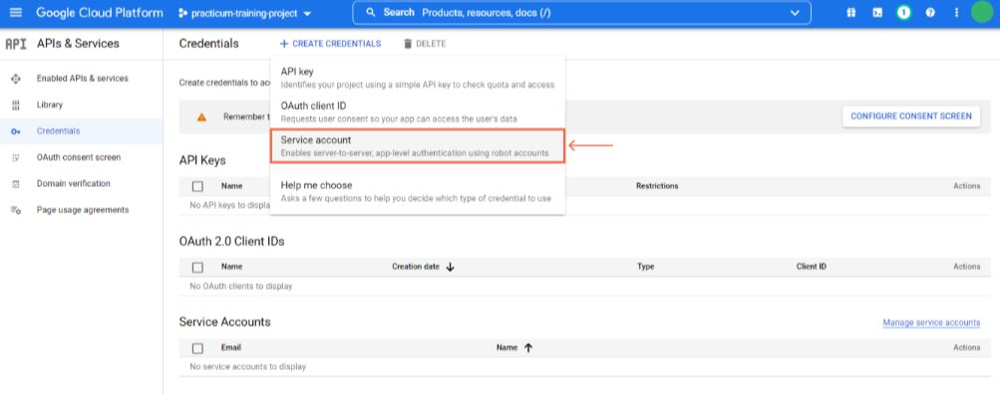

# FastAPI-Restaurant
## Описание проекта
### Схема базы данных


### Важный функционал
1. Вывод количества подменю и блюд для Меню через один (сложный) ORM запрос реализован в методе [show()](app/menu/dao.py) класса `MenuDAO`
2. В файле [test_all.py](app/tests/test_all.py) реализован тестовый сценарий «Проверка количества блюд и подменю в меню»

    Во всех остальных файлах каталога `app/tests` написаны CRUD тесты для разработанных API:
    > * [test_menu.py](app/tests/test_menu.py)
    > * [test_submenu.py](app/tests/test_submenu.py)
    > * [test_dish.py](app/tests/test_dish.py)
    > * [test_full_list_menus.py](app/tests/test_full_list_menus.py)


3. Ручки API описаны в соответствий c OpenAPI:


    Сделано:
    * Документирование роутов: добавление к ним описания, что они делают, какую схему данных возращают и какие ответы.
    * В общее описание проекта добавлено имя проекта, его краткое описание, мои контакты и версия API.
    * Детальное описание эндпоинтов с помощью docstring.
    * Описание параметров, принимаемых в эндпоинтах.

4. Для тестов реализован функционал [reverse()](app/utils/url.py), который позволяет получить URL адрес для конечной точки API.

5. Обновление меню в базе данных происходит из google sheets раз в 15 сек.
    * Пример таблицы с меню ресторана расположен в файле [Menu.xlsx](app/admin/Menu.xlsx). Данный образец помещается в google sheets.
    * Чтение табличных данных из `Google Sheets` реализовано в методе [get_values()](app/google_api/spreadsheets.py) класса `SpreadSheets`.
    * Обновление данных в БД в соответсвии с google sheets выполнено в методе [run()](app/tasks/db_updater.py) класса `DBUpdater`.
    * Фоновая задача обновления БД (раз в 15 секунд): [update_db()](app/tasks/tasks.py)

6. В таблице google sheets в столбце G указывается размер скидки (в процентах %), которая учитывается при отображении цены на блюдо в ендпоинтах.

### Стартовая конфигурация системы
Перед запуском приложения либо тестов убедитесь в наличии в
директории с проектом файлов `.env` и `.env_test`, хранящие следующие настройки:

* **MODE** = DEV
  > режим запуска приложения (TEST - тестовый; DEV - основной)
* **APP_LINK** = http://restaurant_app:8000/api/v1
  > основной адрес приложения для работы со всеми эндпоинтами
* **CELERY_RUN** = false
  > флаг запуска обработчика сообщений Celery (true | false)
---
* **DB_HOST** = db
  > адрес расположения базы данных
* **DB_PORT** = 5432
  > порт, на котором работает база данных
* **DB_USER** = postgres
  > пользователь базы данных
* **DB_PASS** = postgres
  > пароль для базы данных
* **DB_NAME** = app_db
  > название базы данных
---
* **TEST_DB_HOST** = test_db
  > адрес расположения тестовой базы данных
* **TEST_DB_PORT** = 5432
  > порт, на котором работает тестовая база данных
* **TEST_DB_USER** = postgres
  > пользователь тестовой базы данных
* **TEST_DB_PASS** = postgres
  > пароль для тестовой базы данных
* **TEST_DB_NAME** = test_app_db
  > название тестовой базы данных
----
* **REDIS_HOST** = redis
  > адрес расположения Redis
* **REDIS_PORT** = 6379
  > порт, по которому работает Redis
----
* **RABBITMQ_DEFAULT_USER** = user
  > пользователь для RabbitMQ
* **RABBITMQ_DEFAULT_PASS** = password
  > пароль для RabbitMQ
* **RABBITMQ_DEFAULT_PORT** = 5672
  > порт для RabbitMQ
* **RABBITMQ_HOST** = rabbitmq
  > хост для RabbitMQ
-----
* **API_CREDENTIALS_FILE** = credentials.json
  > JSON-файл с информацией о вашем сервисном аккаунте, его приватный ключ, ID и ссылки для авторизации…
* **EMAIL** = example@mail.ru
  > адрес электронной почты, которая привязана к Google Cloud Platform
* **SHEET_ID** = 1iqEWKFfWqlchjbbKmGcZ1-P-.....
  > идентификатор страницы в google sheets

## Установка и запуск

Скопируйте репозиторий используя следующую команду:

```bash
git clone https://github.com/YuryRass/FastAPI_Restaurant.git
```

Затем перейдите в каталог с проектом:

```bash
cd FastAPI_Restaurant
```

Далее необходимо добавить в корень проекта свой собственный JSON-файл `credentials.json` с ключом доступа к сервисному аккаунту в Google Cloud Platform. Пример структуры данного JSON-файла находится в файле [credentials.example.json](credentials.example.json)

Порядок создания JSON-файла с ключом доступа к сервисному аккаунту в Google Cloud Platform показан [внизу](#credentials)

Также в корне проекта переименуйте конфигурационные файлы `.env.example` и `.env_test.example` на `.env` и `.env_test`

На операционной системе Linux переименовать файлы можно следующей командой:

```bash
mv .env.example .env && mv .env_test.example .env_test
```

После всех переименований необходимо указать собственные значения для переменных **EMAIL** и **SHEET_ID** в файле `.env`

Если вам нужен **новый идентификатор** google sheets, то необходимо в корне проекта выполнить скрипт:
```bash
python3 generate_sheet.py
```
Данный скрипт выведет новый уникальный ID удаленной таблицы и предоставит вам доступ к ней. Потом не забудьте присвоить полученный ID переменной **SHEET_ID**.


### Основной запуск проекта

Для основного запуска проекта введите команду:


```bash
docker compose up -d --build --remove-orphans
```

```P.S. Для корректного запуска тестовых сценариев в Postman необходимо присвоить значение false переменной CELERY_RUN в файле .env```

### Запуск проекта с прохождением тестов

Тестовые сценарии расположены в каталоге `app/tests`

Для запуска проекта с прохождением тестов через pytest используйте команду:

```bash
docker compose -f docker-compose-test.yml up -d --build --remove-orphans && docker logs --follow test_rest_app && docker compose -f docker-compose-test.yml down -v
```

# Credentials
Для создания сервисного аккаунта нужен гугл-аккаунт в [Google Cloud Platform](https://console.cloud.google.com/projectselector2/home/dashboard).

Заходите на платформу и создаете проект (если он еще не создан):


Проект создан, следующий шаг — подключить к нему необходимые API. В Google Cloud Platform доступно около 380 API, для работы с гугл-таблицами вам нужно два из них — Google Drive API и Google Sheets API.


После подключения всех API можно создать сервисный аккаунт.
Перейдите в раздел Credentials (англ. «учётные данные»):


Нажмите кнопку Create credentials (англ. «создать учётные данные») и выберите пункт Service account (англ. «сервисный аккаунт»):

Откроется форма для создания сервисного аккаунта:

Введите адрес вашего личного аккаунта в поле Service account admins role:

Теперь нажмите кнопку Done, сервисный аккаунт на месте:

К API он уже подключён, это происходит автоматически, через минуту-две после создания сервисного аккаунта.

Убедитесь в этом: перейдите на экран Enabled APIs & Services, проскролльте экран до списка API и перейдите сначала к Google Sheets API, а потом к Google Drive API. Посмотрите, подключился ли к ним сервисный аккаунт. Это можно сделать на вкладке Credentials, сервисный аккаунт должен отобразиться внизу:


Осталось получить JSON-файл с ключом доступа к сервисному аккаунту.

Перейдите на экран Credentials, нажмите на строчку с названием вашего сервисного аккаунта, чтобы попасть в его настройки. Нажмите Keys – Add Key – Create New Key, чтобы создать ключ доступа к вашему сервисному аккаунту:

Платформа предложит сохранить файл, в котором будут собраны все необходимые данные для работы ваших Python-приложений с подключёнными ранее API. Выберите формат JSON и нажмите Create:

На ваш компьютер скачается JSON-файл с информацией о вашем сервисном аккаунте, его приватный ключ, ID и ссылки для авторизации, а на платформе активируется бессрочный ключ:


Переместите JSON-файл в надёжное место и никому не передавайте!

## Контакты

**telegram** [@YurySundown](https://t.me/YurySundown)

**e-mail** <yurchik1997yurchik@gmail.com>
